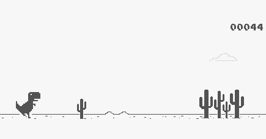

[](https://twitter.com/Patelmubeen99)
[](https://www.python.org/)

**:blue_heart: Open Source**

<h1 align="center">Google's Dinosaur Game Bot<sub style="color:red">BETA</sub></h1>
<p align="center"></p>

> **Google's Dinosaur Game Bot** because We programmer like to do the things in the way humans think it is miracle you can also search for Wizard. :smile:
This is an automatic player bot for Google's dinosaur game and this technique can be used to make bot for any other game.

## Why use Google's Dinosaur Game Bot?

Because We are too lazy to press sapcebar each time a tree appears on the screen :smile:

## Installation

1. Clone the repository

```
git clone https://github.com/mubeenpatel99/google-Dinosaur-game-bot.git
```

2. Install Python and any IDE I use pycharm

```
* [Pycharms free open source community section](https://www.jetbrains.com/pycharm/download/#section=windows)
```

3. Open the link for the game
```
* [Dinosaur Game](http://www.trex-game.skipser.com/)
```

4. Divide the screen in two parts
```
Left side will be the browser and the right side will be the IDE.
```
<p align="center"></p>

5. Run the server
```
python bot.py
```


## Information

If this doesn't work properly change the co-ordinates, and if you don't undertand it contact me.
